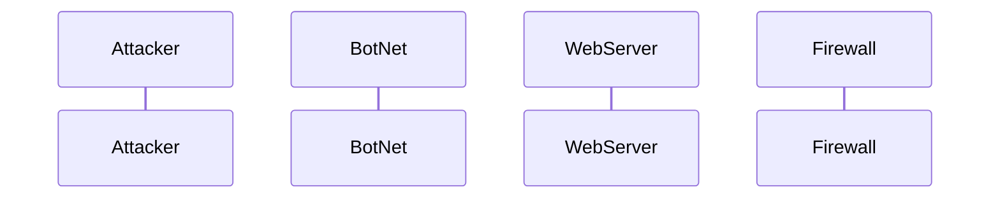

# DDOS_Attack_Sequence.md

Attacker->>BotNet: Sends command to initiate DDoS attack
BotNet->>WebServer: Floods with malicious traffic
WebServer->>Firewall: Receives incoming requests
Firewall->>Firewall: Analyzes traffic for patterns
Firewall-->>WebServer: Filters out malicious requests
Firewall->>WebServer: Blocks suspicious IP addresses
WebServer->>WebServer: Attempts to process remaining requests (overwhelmed)
WebServer-->>BotNet: Unable to respond (service degraded)

